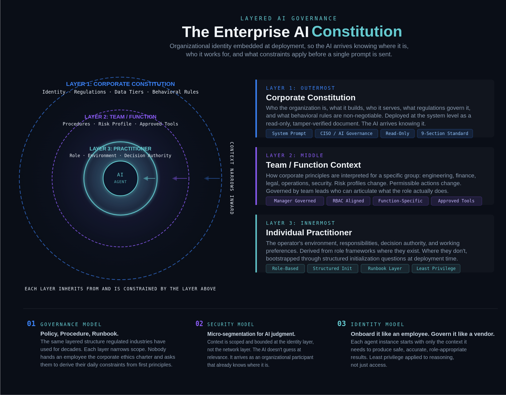

# Enterprise AI Constitution Standard

An open framework for governing AI behavior at the organizational level.



---

## What Is an AI Constitution?

An AI constitution is a system-level governance document that gives an AI assistant organizational identity, authority boundaries, data handling rules, behavioral mandates, and refusal logic — before it ever receives a user prompt.

It answers a question most enterprise AI deployments skip: **Does the AI operating in your organization know who it works for?**

Without a constitution, every AI session starts from zero. The model has no awareness of your regulatory obligations, data classification tiers, intellectual property boundaries, or safety constraints. The user becomes the sole source of organizational context — a responsibility most users aren't equipped to carry and shouldn't have to.

The constitution changes that. It deploys organizational identity at the system level, so the AI arrives already knowing where it is, what it's allowed to do, and where the lines are.

---

## How the Standard Is Organized

The constitution is structured in **9 sections**, each addressing a distinct governance concern:

| # | Section | Purpose |
|---|---------|---------|
| 01 | [Identity](standard/01-identity/) | Who the AI is and who it represents |
| 02 | [Organizational Context](standard/02-organizational-context/) | What the organization does, who it serves, what regulations apply |
| 03 | [Authority Limits](standard/03-authority-limits/) | What the AI is and is not authorized to do |
| 04 | [Data Classification](standard/04-data-classification/) | Tiered data handling rules |
| 05 | [Behavioral Mandates](standard/05-behavioral-mandates/) | Non-negotiable behavioral rules (confidentiality, IP, code review, irreversible actions, external comms) |
| 06 | [Misuse Detection](standard/06-misuse-detection/) | Patterns the AI must flag (personal use, exfiltration, bypass, injection, sycophancy) |
| 07 | [Refusal Logic](standard/07-refusal-logic/) | How and when to refuse requests |
| 08 | [Scope Limitations](standard/08-scope-limitations/) | What the AI is not — boundaries of its role |
| 09 | [Integrity Verification](standard/09-integrity-verification/) | Optional: cryptographic verification of document integrity |

---

## The Context Onion

The constitution is designed to work as part of a **layered governance model** — the Context Onion:

- **Corporate layer** (outermost) — The constitution. Deployed system-wide, read-only, non-negotiable. Defines identity, regulations, data tiers, and behavioral rules for the entire organization.
- **Team layer** (middle) — Team-level addenda that interpret corporate rules for a specific function (engineering, finance, legal, OT operations). Governed by team leads.
- **Practitioner layer** (innermost) — Individual context: the operator's responsibilities, systems, and decision authority. Can be bootstrapped through structured initialization.

Each layer narrows the scope. Each layer builds on the one above. The AI that reaches the practitioner isn't a general-purpose tool guessing at relevance — it's an organizational participant that already knows where it is.

---

## Quick Start

### 1. Build your constitution

Run the interactive [constitution builder](tools/) to generate your constitution with real-time token tracking:

```bash
python tools/constitution-builder.py
```

Or start with the [corporate constitution template](templates/corporate-constitution.md) and fill in your organization's details manually.

### 2. Customize for your teams

Use the builder with `--tier 2` or the [team constitution template](templates/team-constitution.md) to create function-specific addenda.

### 3. Validate

Run the [test suite](tests/) against your constitution to verify it behaves as expected.

---

## Repository Structure

```
enterprise-ai-constitution/
├── standard/           # The 9-section standard with guidance
├── templates/          # Ready-to-use fill-in-the-blank templates
├── examples/           # Anonymized real-world examples
├── tests/              # Test suite for validating a constitution
├── tools/              # Interactive constitution builder with token tracking
└── docs/               # Deep-dive articles and deployment guides
```

---

## Examples

- [Manufacturing Company](examples/manufacturing-company.md) — A mid-market industrial manufacturing company with ITAR, NERC CIP, and ISO 27001 obligations.

---

## Contributing

See [CONTRIBUTING.md](CONTRIBUTING.md) for guidelines on proposing changes, adding examples, or suggesting new standard sections.

---

## License

This work is licensed under [Creative Commons Attribution 4.0 International (CC BY 4.0)](LICENSE).

You are free to share, adapt, and build upon this standard for any purpose, including commercial use, as long as you provide attribution.

---

## Status

This standard is under active development. Version 1.0 reflects real-world production deployment and validation at scale, but the framework continues to evolve based on community feedback and operational experience.

If you're using this framework — or considering it — we'd like to hear from you. Open an issue, submit a PR, or start a discussion.
